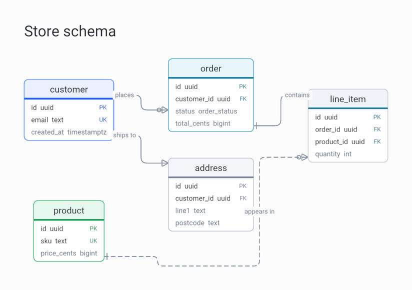
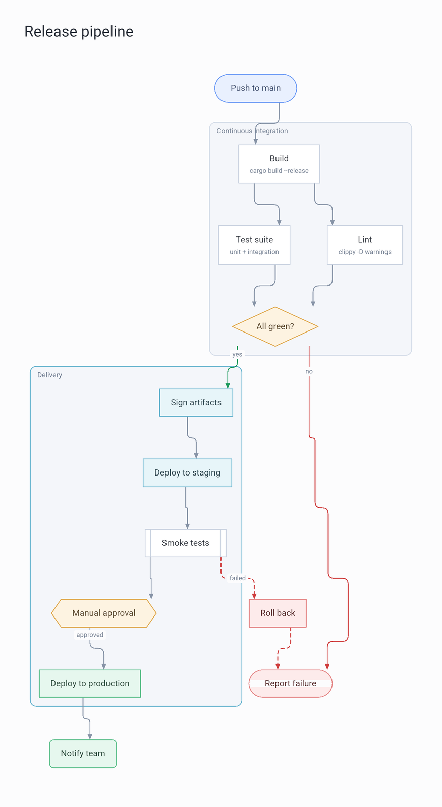
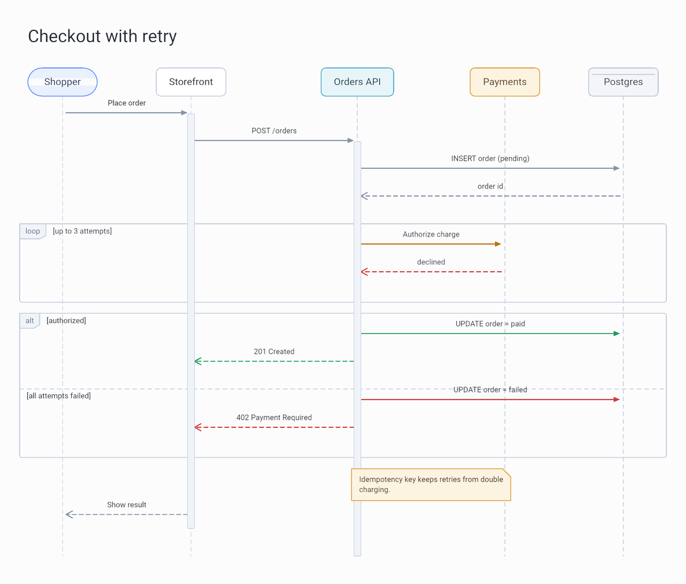
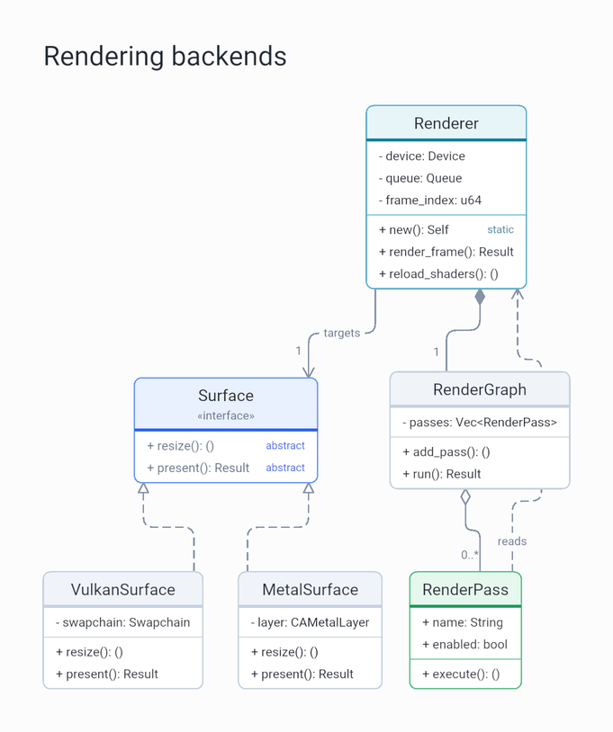
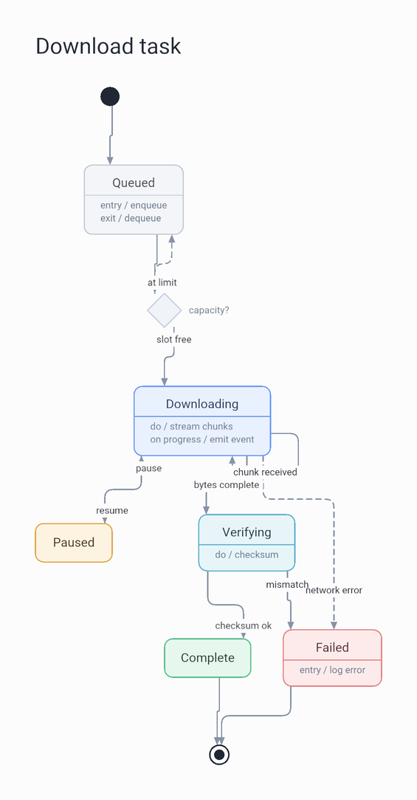
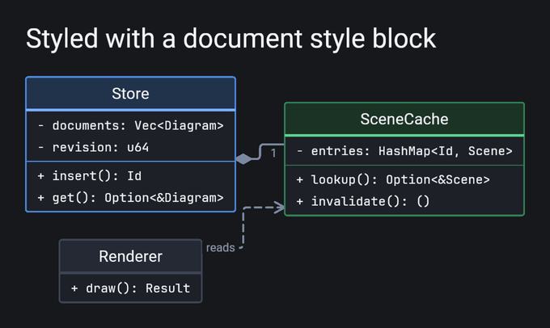

# graphiti

Diagrams as data. A document goes in as JSON, a rendered image comes out.

Every diagram is one struct with a single `kind` field. That field is a tagged
enum, and each variant carries a plain struct describing that kind of diagram.
So the format is the Rust data model, and adding a diagram kind means adding a
variant and a generator for it.

Layout and rendering are ours end to end: a layered graph layout with crossing
minimization, orthogonal edge routing with rounded corners, and geometry drawn
through [nightshade](https://github.com/matthewjberger/nightshade) with an
orthographic camera, supersampled and downsampled for clean edges.

## A document and its image

```json
{
  "kind": {
    "type": "entity_relationship",
    "title": "Store schema",
    "direction": "right",
    "entities": [
      {
        "id": "customer",
        "name": "customer",
        "accent": "primary",
        "attributes": [
          { "name": "id", "type_name": "uuid", "key": "primary" },
          { "name": "email", "type_name": "text", "key": "unique" }
        ]
      },
      {
        "id": "order",
        "name": "order",
        "accent": "info",
        "attributes": [
          { "name": "id", "type_name": "uuid", "key": "primary" },
          { "name": "customer_id", "type_name": "uuid", "key": "foreign" },
          { "name": "total_cents", "type_name": "bigint" }
        ]
      }
    ],
    "relationships": [
      {
        "from": "customer",
        "to": "order",
        "label": "places",
        "from_cardinality": "exactly_one",
        "to_cardinality": "zero_or_many"
      }
    ]
  }
}
```

```sh
graphiti schema.json -o schema.png
```



## Running it

```sh
# render a document; the image lands next to it unless you pass -o
cargo run -r -- examples/flowchart.json -o out/flowchart.png

# the dark palette
cargo run -r -- examples/flowchart.json --theme dark -o out/flowchart.png

# render every example into out/
just render
```

Options: `-o/--output` for the destination, `--theme light|dark`, and
`--supersample 1..4` for how much the renderer oversamples before downsampling
(2 by default).

The [playground](https://matthewberger.dev/graphiti/) runs the same schema,
layout, and renderer in the browser, with the engine on an `OffscreenCanvas` in
a web worker. To serve it locally:

```sh
just init-wasm    # once: wasm target, trunk, wasm-bindgen, wasm-opt
just playground   # serves http://127.0.0.1:8080
```

> The playground needs WebGPU, which every Chromium browser and Firefox 141+
> support.

## Diagram kinds

Five kinds ship today. Each is one `type` value and one struct, and each image
below is the rendered output of the document next to it.

### `flowchart`

Ten node shapes, semantic accents, subgraph containers, and edges with their own
styles and arrow heads. Groups reserve their own space, so a container never
lands on a node that is not in it.

[examples/flowchart.json](examples/flowchart.json)



### `sequence`

Lifelines with activation bars, sync, async and reply messages, notes, dividers,
and nested `loop` / `alt` / `opt` / `par` fragments with branches.

[examples/sequence.json](examples/sequence.json)



### `class`

Compartment boxes with stereotypes, visibility markers, static and abstract
badges, and the full set of UML relations: inheritance, realization,
composition, aggregation, association, and dependency, each with its own line
and end decoration.

[examples/class.json](examples/class.json)



### `state`

Start, end, choice, fork, and join markers alongside simple states with
description lines. Transitions carry labels, and a pair of opposing transitions
is drawn as two lanes rather than one overlapping line.

[examples/state.json](examples/state.json)



### `entity_relationship`

Entities with typed attributes and `PK` / `FK` / `UK` badges, related with crow's
foot notation on both ends. A non-identifying relationship is dashed.

[examples/entity_relationship.json](examples/entity_relationship.json)


## Theming and customization

Three palettes ship: `light`, `dark`, and `mono` for print. Pick one per render
with `--theme`, or let the document decide.

Nodes, edges, groups, participants, and states carry an `accent` role rather
than a color: `primary`, `success`, `warning`, `danger`, `info`, `muted`, or
`neutral`. The theme resolves each role into a fill, a border, a strong line
color, and a text color, which is why the same document reads correctly in every
palette.

Anything else is an optional `style` block on the diagram itself, so a document
can carry its own look with no flags at the call site:

```json
{
  "kind": {
    "type": "class",
    "style": {
      "theme": "dark",
      "compact": true,
      "monospace": true,
      "zoom": 1.1,
      "corner_radius": 3,
      "palette": {
        "background": "#0F1116",
        "primary": { "fill": "#1B2E4A", "border": "#4C86D8", "strong": "#7FB2FF" }
      }
    },
    "classes": []
  }
}
```



That covers base theme, per-role palette overrides, a zoom factor, a compact
mode, monospace member rows, and individual control over font sizes, padding,
rank and sibling gaps, corner radius, border and edge widths, arrow size,
margin, and line height. Every field is optional, and unknown fields are
rejected so a typo fails loudly. The full list is in
[docs/format.md](docs/format.md#the-style-block).

More on the data model, the layout pipeline, and how to add a kind:
[docs/format.md](docs/format.md), [docs/layout.md](docs/layout.md),
[docs/adding-a-kind.md](docs/adding-a-kind.md).

## Prerequisites

* A GPU with Vulkan, Metal, or DX12, since rendering goes through wgpu
* [just](https://github.com/casey/just) for the recipes above
* [trunk](https://trunkrs.dev/) and the wasm target for the playground

## License

Licensed under either of:

- Apache License, Version 2.0 ([LICENSE-APACHE](LICENSE-APACHE) or http://www.apache.org/licenses/LICENSE-2.0)
- MIT license ([LICENSE-MIT](LICENSE-MIT) or http://opensource.org/licenses/MIT)

at your option.
