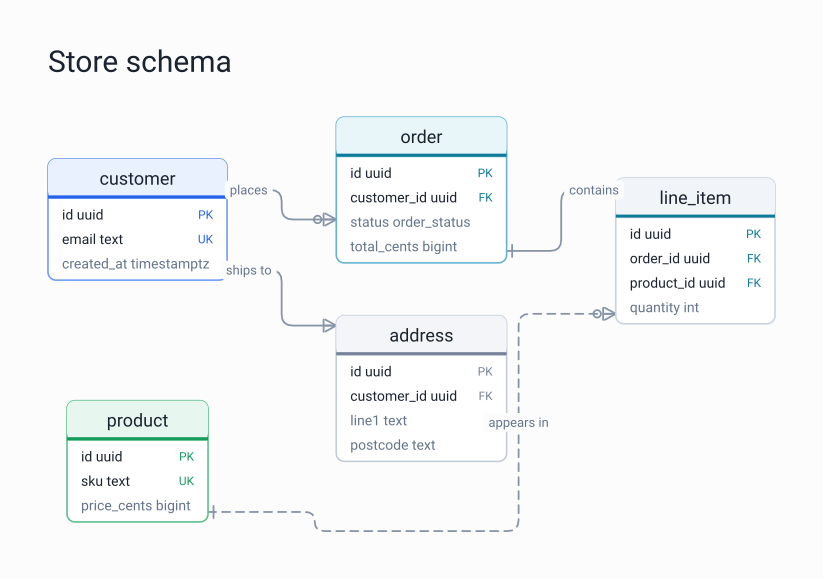
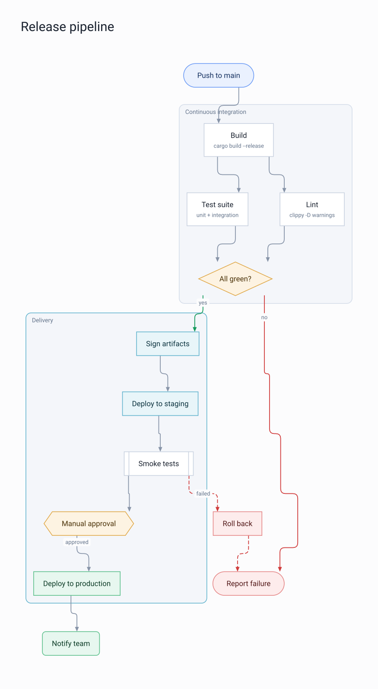
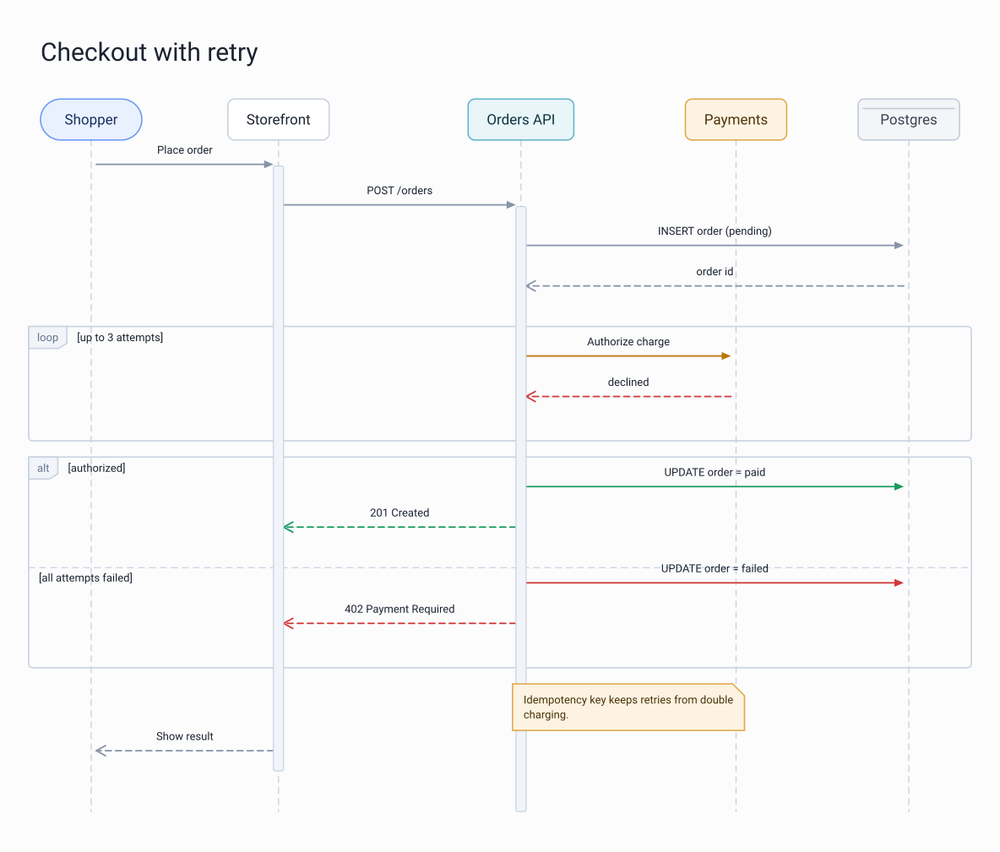
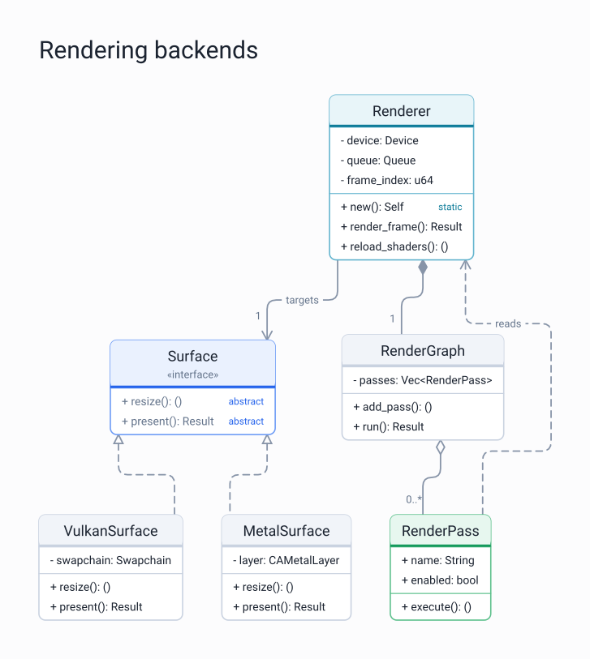
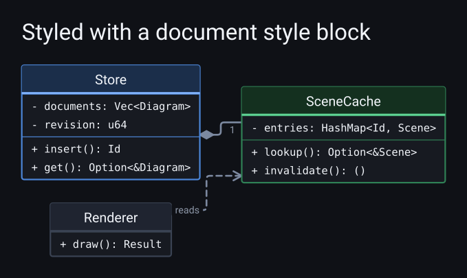

# graphiti

Diagrams as data. A document goes in as JSON, a rendered image comes out.

Every diagram is one struct with a single `kind` field. That field is a tagged
enum, and each variant carries a plain struct describing that kind of diagram.
So the format is the Rust data model, and adding a diagram kind means adding a
variant and a generator for it.

Layout is ours end to end: a layered graph layout with crossing minimization and
orthogonal edge routing with rounded corners. That produces a resolution
independent scene, which goes out as SVG, or as a PNG rasterized by
[nightshade](https://github.com/matthewjberger/nightshade) under an orthographic
camera.

## A document and its image

```json
{
  "kind": {
    "type": "entity_relationship",
    "title": "Store schema",
    "direction": "right",
    "entities": [
      {
        "id": "customer",
        "name": "customer",
        "accent": "primary",
        "attributes": [
          { "name": "id", "type_name": "uuid", "key": "primary" },
          { "name": "email", "type_name": "text", "key": "unique" }
        ]
      },
      {
        "id": "order",
        "name": "order",
        "accent": "info",
        "attributes": [
          { "name": "id", "type_name": "uuid", "key": "primary" },
          { "name": "customer_id", "type_name": "uuid", "key": "foreign" },
          { "name": "total_cents", "type_name": "bigint" }
        ]
      }
    ],
    "relationships": [
      {
        "from": "customer",
        "to": "order",
        "label": "places",
        "from_cardinality": "exactly_one",
        "to_cardinality": "zero_or_many"
      }
    ]
  }
}
```

```sh
graphiti schema.json -o schema.svg
```



## Running it

```sh
# the output extension picks the format
cargo run -r -- examples/flowchart.json -o out/flowchart.svg
cargo run -r -- examples/flowchart.json -o out/flowchart.png

# the dark palette
cargo run -r -- examples/flowchart.json --theme dark -o out/flowchart.svg

# render every example into out/
just render
```

Options: `-o/--output` for the destination and format, `--theme light|dark|mono`,
and `--supersample 1..4` for how much the rasterizer oversamples before
downsampling (2 by default, PNG only).

Anything a generator would drop instead of guessing about, like an edge pointing
at an id no node has or two nodes sharing an id, goes to stderr before the file
is written. The diagram still renders.

## Output formats

| Extension | Path | Notes |
| --- | --- | --- |
| `.svg` | Scene straight to SVG, no GPU | Scales to any size, ~10 KB per diagram, and the default when `-o` is omitted |
| `.png` | Scene to geometry, drawn by nightshade under an orthographic camera | Supersampled and downsampled for clean edges; needs a GPU |

Both come from the same `Scene`, so a document renders identically either way
apart from font substitution: the SVG names a font stack and the viewer picks
what it has, while the PNG rasterizes the font the layout was measured with.

## Playground

The [playground](https://matthewberger.dev/graphiti/) runs the same schema,
layout, and SVG writer in the browser and drops the result straight into the
page, so the diagram redraws as you change it. No GPU is involved.

- **Diagram** tab: build the document top down. Pick the kind, then add nodes,
  edges, groups, participants, steps, classes, states, or entities, each with the
  same shapes, accents, arrow heads, and cardinalities the format has. Endpoints
  are pickers over the ids that exist, so an edge cannot point at nothing by
  accident, and renaming an id carries every reference to it along. The search box
  filters long lists.
- **JSON** tab: the same document as syntax-highlighted text, editable by hand.
  The two tabs are one document, so a change in either shows up in the other.
- Anything the renderer would silently drop, like a dangling reference or a
  duplicate id, is listed under the editor while you work.
- **Save SVG** writes the file the CLI would write. **Save PNG** rasterizes the
  current SVG at 2x through a canvas, only when you press it, so its text uses
  whichever font the browser resolved rather than the one the layout measured.

To serve it locally:

```sh
just init-wasm    # once: wasm target, trunk, wasm-bindgen
just playground   # serves http://127.0.0.1:8080
```

## Diagram kinds

Five kinds ship today. Each is one `type` value and one struct, and each image
below is the rendered output of the document next to it.

### `flowchart`

Ten node shapes, semantic accents, subgraph containers, and edges with their own
styles and arrow heads. Groups reserve their own space, so a container never
lands on a node that is not in it.

[examples/flowchart.json](examples/flowchart.json)



### `sequence`

Lifelines with activation bars, sync, async and reply messages, notes, dividers,
and nested `loop` / `alt` / `opt` / `par` fragments with branches.

[examples/sequence.json](examples/sequence.json)



### `class`

Compartment boxes with stereotypes, visibility markers, static and abstract
badges, and the full set of UML relations: inheritance, realization,
composition, aggregation, association, and dependency, each with its own line
and end decoration.

[examples/class.json](examples/class.json)



### `state`

Start, end, choice, fork, and join markers alongside simple states with
description lines. Transitions carry labels, and a pair of opposing transitions
is drawn as two lanes rather than one overlapping line.

[examples/state.json](examples/state.json)


### `entity_relationship`

Entities with typed attributes and `PK` / `FK` / `UK` badges, related with crow's
foot notation on both ends. A non-identifying relationship is dashed.

[examples/entity_relationship.json](examples/entity_relationship.json)


## Theming and customization

Three palettes ship: `light`, `dark`, and `mono` for print. Pick one per render
with `--theme`, or let the document decide.

Nodes, edges, groups, participants, and states carry an `accent` role rather
than a color: `primary`, `success`, `warning`, `danger`, `info`, `muted`, or
`neutral`. The theme resolves each role into a fill, a border, a strong line
color, and a text color, which is why the same document reads correctly in every
palette.

Anything else is an optional `style` block on the diagram itself, so a document
can carry its own look with no flags at the call site:

```json
{
  "kind": {
    "type": "class",
    "style": {
      "theme": "dark",
      "compact": true,
      "monospace": true,
      "zoom": 1.1,
      "corner_radius": 3,
      "palette": {
        "background": "#0F1116",
        "primary": { "fill": "#1B2E4A", "border": "#4C86D8", "strong": "#7FB2FF" }
      }
    },
    "classes": []
  }
}
```



That covers base theme, per-role palette overrides, a zoom factor, a compact
mode, monospace member rows, and individual control over font sizes, padding,
rank and sibling gaps, corner radius, border and edge widths, arrow size,
margin, and line height. Every field is optional, and unknown fields are
rejected so a typo fails loudly. The full list is in
[docs/format.md](docs/format.md#the-style-block).

More on the data model, the layout pipeline, and how to add a kind:
[docs/format.md](docs/format.md), [docs/layout.md](docs/layout.md),
[docs/adding-a-kind.md](docs/adding-a-kind.md).

## Prerequisites

* A GPU with Vulkan, Metal, or DX12 for PNG output, since that path goes through
  wgpu. SVG output and the playground need no GPU.
* [just](https://github.com/casey/just) for the recipes above
* [trunk](https://trunkrs.dev/) and the wasm target for the playground

## License

Licensed under either of:

- Apache License, Version 2.0 ([LICENSE-APACHE](LICENSE-APACHE) or http://www.apache.org/licenses/LICENSE-2.0)
- MIT license ([LICENSE-MIT](LICENSE-MIT) or http://opensource.org/licenses/MIT)

at your option.
